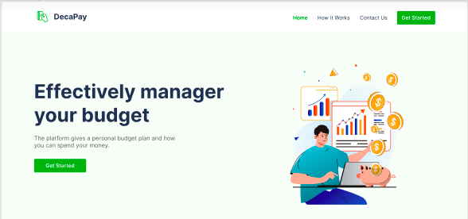

# DECAPAY PERSONAL FINANCIAL TRACKER

  

Welcome to DecaPay Budget Tracker, a personal finance tool that helps you keep track of your budget and expenses. 
This simple and easy-to-use app allows you to track your income and expenses, so you can stay on top of your financial situation and make informed decisions about your money.

Our tracker is designed to help you keep track of your budget and manage your finances more effectively. 
Whether you're a student trying to stay on top of your expenses, a busy professional looking to save more money, 
or someone simply looking to gain more control over their spending habits, our tracker is here to help.

### With Budget Tracker, you can:

* Create a budget and set spending limits for different categories of expenses (e.g. groceries, rent, entertainment)
* Add and categorize your income and expenses
* View a summary of your current financial situation, including your total income and expenses, net income, and budget progress
* See a breakdown of your expenses by category, so you can see where your money is going
* Monitor your budget over time, and see how your spending habits are changing

### For example:
***
#### Budget A (Monthly - July)
    Transportation - $300
    Groceries - $800
    Utilities - $250
    Rent. - $1700

TOTAL Budget for the month of July: **$3050**
***
#### Actual: (July) - When you make a spend, you log it.
    Transportation - $2
    Transportation - $5
    Groceries - $50
    Groceries - $24
    Groceries. - $60

TOTAL expenses so far: **$141**
***

### Here are some of the key features of the DecaPay personal finance tracker:

* **Easy-to-use interface:** Our tracker is designed with simplicity in mind. 
You can quickly and easily create budget list items for any periodic range 
(weekly, monthly, annually, or custom) and indicate the projected amount you want to spend on them, 
and our tracker will automatically help you track your expenses. 
This makes it easy to see where your money is going and track your spending habits over time.

* **Budget management:** Our tracker allows you to create and manage a budget, 
so you can easily see how much money you have to spend each month and where you can cut back if necessary. 
You can set limits for each category of spending, and our tracker will automatically alert you if you're on track to exceed your budget.

* **Clear reports:** Our tracker provides clear, easy-to-understand reports that show you where your 
money is going and how you're spending it. You can see a breakdown of your spending by category, 
and compare your current spending habits to previous months or periods. 
This helps you identify areas where you may be able to save more money and make better financial decisions.

* **Security:** We take your security seriously, and our tracker is designed with your privacy in mind. 
We use industry-standard encryption to protect your data, and we never share your personal information with anyone.

* **Mobile access:** Our tracker is accessible from any device, so you can track your finances on the go. 
Whether you're on a laptop, tablet, or smartphone, you can easily input your income and expenses and access your reports from anywhere.

Budget Tracker is a great way to take control of your finances and make sure you're staying within your budget. Give it a try today,
and see how it can help you reach your financial goals!

